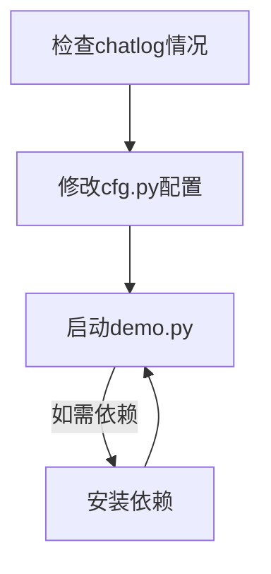

# KiSS_wx_chat_auto_summary
🚀 Python聊天群日志魔法师：让繁杂群聊变成精华笔记！自动提取、智能总结，多种输出格式随心选，告别信息焦虑，轻松捕捉每一个闪光时刻！💫

## 项目简介

KiSS_wx_chat_auto_summary 是一个用于微信群聊天记录的自动提取、归纳和可视化的程序。利用 chatlog 工具获取微信指定群的聊天记录，然后通过 Google Gemini 2.5 Pro 大模型 API 进行分析处理，最终生成美观的 HTML 格式报告。

## 鸣谢：先感谢大佬们的技术引路！

能搞出这个项目，绝对是站在了巨人的肩膀上。衷心感谢以下大佬的技术支持：

- **数字生命卡兹克:** 脑洞大开，写好的文章、分享的模板、趟完的路，直接就能用，太给力了！
- **Simonlin大佬:** 提供的解决方案和源源不断模板，思路清晰，操作性强！
- **sjzar大佬:** chatlog 这个工具，简直是基石中的基石，没有它一切都白搭！感谢大佬的无私奉献！

## 基本思路
你好，我现在正在构思一个微信群聊天记录的自动提取、归纳和可视化的程序。
我的基本思路如下：
1、使用【chatlog工具】的命令行版，来获取微信软件的指定群的聊天记录。
2、获取到聊天记录之后，使用【Google 的 Gemini 2.5 Pro 大模型的API】，来根据【特定prompt】，对【聊天记录】进行分析、并生成一个html的
文件。

## 最终效果示例


## 提前准备（最佳食用环境）：

1. 目前我的测试环境：  Win10 工作站版  +  Python3.11  +  微信4.0.3.36
2. 微信环境：
   1. 需要3.x或者4.x的PC版微信。（Windows版，实测可行）
   2. 3.x版本，聊天记录提取更为稳定，但最新消息更新不够及时。
   3. 4.x版本，目前【4.0.3.36及以下】稳定支持；【4.0.3.36以上】存在解密失败的概率。
      1. 【4.0.3.36】老版本第三方下载地址（请自行甄别安全性，最好是用你官方下载的低版本）：
         1. 大佬提供：[关联 4.0.3.36 下载地址](https://github.com/sjzar/chatlog/issues/46#issuecomment-2810034505)
3. 所调用大模型
   1. 推荐Gemini 2.5 Pro，支持1M（1000K）上下文长度，基本适应于所有【999+群聊场景】。
      1. 提前准备：  
         1. 相关Google Gemini账号API Key。
         2. 可能需要科学上网，以连通API接口。
4. Python环境
   1. 目前采用Python3.11
   2. 需要按照以下依赖：
      1. `pip install google-generativeai tqdm requests`
      2. 此处需要注意：
         1. 【google.generativeai】模块的正式包名为【google-generativeai】。
         2. 安装容易受网络影响失败；可提前准备较好的网络环境、或者多试几次。


## 实现流程

### 最小化实现步骤

1. 总结：


2. **下载 chatlog 工具**
   - 从 [GitHub Releases](https://github.com/sjzar/chatlog/releases) 下载最新版本
   - 解压获取 chatlog.exe 到指定目录

3. **首次配置**
   - 打开 chatlog GUI 界面
   - 开启"自动更新"选项
   - 确认微信识别状态为"online"
   - 记录"Data Dir"和"Work Dir"路径值
   - 配图示意：
     - 

4. **配置 cfg.py 文件**
   - 填入 Data Dir 和 Work Dir 路径
   - 设置其他必要配置项
   - 图片示意：
     - 

5. **运行程序**
   - 执行 `python demo.py`
     - 这是最简单的方式，配置都放在 `cfg.py`  。
   - 程序将生成 HTML 格式总结报告
   - 可配置自动打开生成的报告预览
   - 错误日志将保存在 logs 目录中

### chatlog 工具使用详解

chatlog 工具的命令行使用方法：

```bash
# 获取微信数据密钥
chatlog key

# 解密数据库文件（每次都要执行，以获取最新的聊天记录）
chatlog decrypt

# 启动 HTTP 服务（支持微信 v3、v4）
chatlog server --addr "127.0.0.1:5030" \
               --data-dir "D:/Users/Administrator/Documents/WeChat Files/wxid_km81v7w6fe9422" \
               --work-dir "C:/Users/Administrator/Documents/chatlog/wxid_km81v7w6fe9422" \
               --platform "windows" \
               --version 3
```

访问 chatlog 的 HTTP 接口读取聊天记录：

```
# 获取【创新点子】聊天群的聊天记录    （后面部分的中文，会被自动编码，无须担心）
GET http://127.0.0.1:5030/api/v1/chatlog?time=2025-01-01~2025-04-23&talker=创新点子
```

## 数据格式示例

chatlog 接口返回的数据格式示例：

```
02-17 17:04:34
"用户A"邀请你和"用户B、用户C"加入了群聊

用户A(wxid_******) 02-17 17:04:34
[呲牙]

我 02-17 17:04:48
yesyes  收到

用户C(wxid_******) 02-17 17:04:51
[动画表情]

我 02-17 17:05:19
[小程序|****知识库](https://*****)

我 02-17 17:06:21
[文件|**** Guide.pdf](http://*****)

 02-17 17:06:24
"用户B"邀请"用户D"加入了群聊

用户A(wxid_******) 02-17 17:06:35
[强]

我 02-17 17:07:17
[文件|****-非法外联应急事件处置手册V1.0.pdf](http://*****)

我 02-17 17:07:17
[文件|****-勒索事件应急事件处置手册V1.0.pdf](http://*****)

我 02-17 17:07:17
[文件|****-网站攻击应急事件处置手册V1.0.pdf](http://*****)

我 02-17 17:07:58


我 02-17 17:07:58


我 02-17 17:10:07
简单提问：如果怀疑客户的机器中了内存马，应该如何判断、排查、处置？

用户C(wxid_******) 02-17 17:10:57
[文件|程序设计语言的形式语义_11411899.pdf](http://*****)

用户C(wxid_******) 02-17 17:11:00
试试这个

我 02-17 17:11:17
> 用户C(wxid_******) 02-17 17:11:00
> 试试这个
可以的，要问问ta（小程序）啥问题

用户A(wxid_******) 02-17 17:11:39
****我笔记本上装了

用户A(wxid_******) 02-17 17:11:45
个人的知识库很好用

用户C(wxid_******) 02-17 17:11:48
问题就是：举一个惰性自然数的例子

我 02-17 17:11:48
[强][强][强][奸笑]  很⑥


我 02-17 17:12:47
明天的****答辩  我准备就搞点进去。然后提前准备一些模拟题     ，加上一点现场随机应变

用户A(wxid_******) 02-17 17:13:06
****还需要现场回答问题？

用户A(wxid_******) 02-17 17:13:11
去年啥也没问呢

我 02-17 17:13:31
年前还要我准备了一下   不知道具体咋搞  有备无患哈哈哈

用户C(wxid_******) 02-17 17:13:56
> 用户A(wxid_******) 02-17 17:11:39
> ****我笔记本上装了
我也下一个看看

用户A(wxid_******) 02-17 17:14:11
哈哈

用户C(wxid_******) 02-17 17:14:56
我们想做的就是他这种

用户C(wxid_******) 02-17 17:15:15
本地客户端+云端知识库

用户C(wxid_******) 02-17 17:15:21
无缝联动

我 02-17 17:15:30
国外有一个  ****  ****

也类似。不过各种文档处理、提取、摘要重新加入材料。自我反刍  的功能多一点

我 02-17 17:15:48


我 02-17 17:16:01
> 我(wxid_******) 02-17 17:15:48
> 
像这种

可以秒出一本书了

我 02-17 17:16:09
大纲有了。每个章节  写一些

我 02-17 17:16:29
> 我(wxid_******) 02-17 17:15:48
> 
这个我塞进去了3个PDF

我 02-17 17:18:11
> 用户C(wxid_******) 02-17 17:10:57
> [文件|程序设计语言的形式语义_11411899.pdf](http://*****)
你这个好像****读不出来。我用  **** ****试一下

用户C(wxid_******) 02-17 17:18:22
[动画表情]

我 02-17 17:22:38


我 02-17 17:22:39
对吗

我 02-17 17:23:40

```

## Prompt 处理

【特定 prompt】存储路径：
```
prompt/微信聊天记录可视化prompt.txt
```
此处采用卡神/Simonlin 的 prompt。

调用大模型时，所采用的外层包裹 prompt：
```
你好，此处的txt为我的【群日报生成要求prompt】，另一份txt为我的【群聊记录】。

请你根据最新的群聊记录，按照prompt要求，生成一份群日报。要求仅返回html，不要返回其他内容。

谢谢
```

更多详细内容请参考代码实现和注释。


## 提示词（Prompt）风格说明

### 【Simonlin大佬】最新版本日报卡片版提示词

**风格特点**：
- 简洁实用，专注于日报卡片式展示
- 版本迭代频繁，持续优化
- 适合产出精简内容的报告

**适用场景**：
- 需要快速生成群聊日报
- 适合分享到微信朋友圈等社交媒体
- 对视觉表现要求较高的场景

**使用建议**：
- 关注作者公众号获取最新版本
- 适合初学者快速上手

### 【卡子哥与Simonlin佬】微信聊天记录可视化提示词

**风格特点**：
- 结构完整，HTML模板详细
- 深色科技风设计，视觉效果突出
- 支持完整版/简化版两种模式
- CSS样式定义精确，确保一致的视觉体验

**适用场景**：
- 需要高质量可视化展示的群聊总结
- 适合正式场合分享的群聊报告
- 需要固定风格的定期群聊总结

**使用建议**：
- 完整版适合内容丰富的长时间群聊记录
- 简化版适合快速浏览和分享
- 固定的HTML模板确保输出一致性

### 【卡兹克群聊神秘R佬】赛博朋克-微信群聊数据可视化与深度分析提示词

**风格特点**：

- 极度详细的分析维度，覆盖技术、应用、社区等多个方面
- 强调深度挖掘和知识提取
- 赛博朋克视觉风格，沉浸式体验
- 三大核心功能：讨论热榜、时间轴回溯、资源库

**适用场景**：
- 技术社区、研究群体的深度分析
- 需要挖掘隐藏知识和价值的长期群聊
- 对AI、技术前沿等专业领域的讨论分析
- 需要建立知识库的专业社区

**使用建议**：
- 适合有一定技术背景的用户
- 对计算资源要求较高，生成内容详尽
- 适合长期积累的群聊知识沉淀
- 特别适合技术分享和学习型社区

## 提示词目录

下表列出了项目中所有可用的提示词，方便您根据需求选择合适的风格和效果：

| 提示词分类 | 提示词名称 | 风格特点 | 适用场景 | 使用建议 |
|---------|---------|---------|---------|---------|
| **核心提示词** | 【Simonlin大佬】最新版本提示词 | 简洁实用，专注于日报卡片式展示，版本迭代频繁 | 快速生成群聊日报，适合分享到社交媒体 | 关注Simonlin大佬公众号获取最新版本 |
| **核心提示词** | 【卡子哥与Simonlin佬】微信聊天记录可视化prompt | 结构完整，HTML模板详细，深色科技风设计 | 高质量可视化展示，支持完整版/简化版模式 | 完整版适合内容丰富的长时间群聊记录<br />简化版适合快速浏览和分享<br />固定的HTML模板确保输出一致性 |
| **核心提示词** | 【卡兹克群聊神秘R佬】赛博朋克-微信群聊数据可视化与深度分析prompt | 极详细分析维度，赛博朋克视觉风格，三大核心功能模块 | 技术社区深度分析，专业知识库建设 | 适合有一定技术背景的用户 <br />生成内容详尽 <br />适合长期积累的群聊知识沉淀<br />特别适合技术分享和学习型社区 |
| **精选风格** | 霍克尼泳池风格 | 鲜艳的色彩、水波纹效果、泳池视觉元素，充满夏日活力 | 休闲社交群、兴趣爱好群、假日活动总结 | 新变种：特定美术风格 |
| **精选风格** | 马莱维奇超现实主义风格 | 几何抽象元素，艺术风格强烈，视觉冲击力大 | 艺术、设计相关群组，创意讨论总结 | 新变种：特定美术风格 |
| **精选风格** | 法贝尔鸟类插画风格 | 自然主题，插画风格，优雅细腻 | 自然爱好者群组，科普教育群，轻松愉悦风格 | 新变种：特定美术风格 |
| **精选风格** | 列纳多达芬奇风格 | 经典艺术风格，精致细节，文艺复兴气息 | 文化、历史、学术讨论群，高端正式场合 | 新变种：特定美术风格 |
| **精选风格** | 洛贝尔公主风格 | 童话风格，色彩柔和，充满童趣 | 亲子群、教育群、轻松友好的社交群 | 新变种：特定美术风格 |
| **精选风格** | 巴萨利茨基未来主义风格 | 前卫抽象，未来感，独特艺术风格 | 科技、前沿讨论群，创新交流群 | 新变种：特定美术风格 |
| **精选风格** | 佩佩特鲁克金漆工风格 | 金色点缀，华丽装饰，质感突出 | 高端社交群，奢侈品讨论，精英交流 | 新变种：特定美术风格 |
| **精选风格** | 蒸汽波风格 | 复古未来感，霓虹色彩，怀旧元素 | 音乐、艺术、亚文化讨论群，年轻群体 | 新变种：特定美术风格 |
| **仿站风格-中级** | 仿照知乎的设计风格 | 简洁专业，问答布局，蓝色主调 | 知识分享群，技术讨论，专业交流 | 效果勉强 |
| **仿站风格-低级** | 仿照苹果官网的设计风格 | 极简高端，大量留白，产品为中心 | 产品发布，设计讨论，高端品牌群 | 效果不佳 |
| **仿站风格-低级** | 仿照小红书的设计风格 | 卡片式布局，图文并茂，社区感强 | 生活分享，种草推荐，兴趣社区 | 效果不佳 |
| **仿站风格-低级** | 仿照抖音的设计风格 | 动态元素，视频为主，黑色主调 | 短视频分享，娱乐交流，年轻群体 | 效果不佳 |

您可以根据群聊内容和目标受众，选择最合适的提示词风格，为您的群聊总结添上独特的一抹颜色。


## 版本更新

| 版本 | 发布日期 | 更新内容 |
|------|----------|----------|
| v0.1.1 | 2025-04-27 22:46 | • 修复了特殊条件下的多个Bug<br>• 新增10个提示词集合（包含核心层级、精选层级和其它普通层级）<br>• 增加版本更新记录模块 |
| v0.1.0 | 2025-04-27 09:00 | • 首次正式发布到GitHub<br>• 基本流程已完整实现<br>• 完善基础文档说明 |
