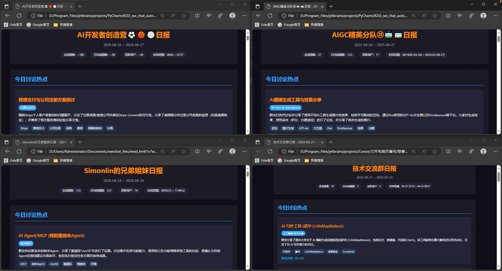
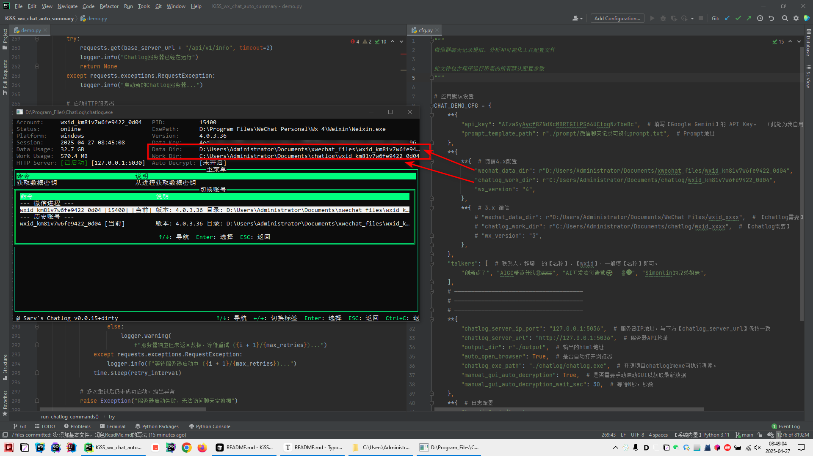
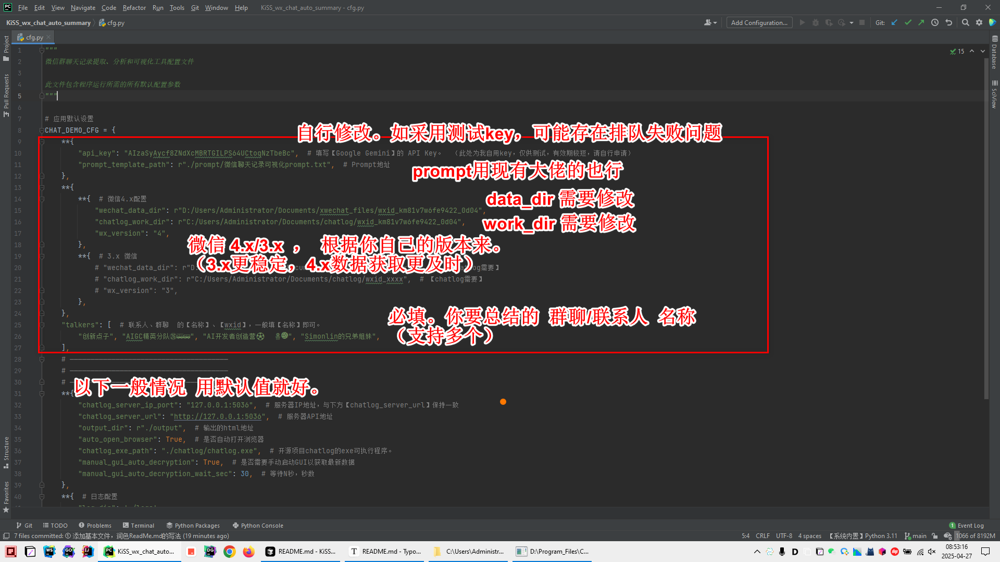

# KiSS_wx_chat_auto_summary
🚀 Python聊天群日志魔法师：让繁杂群聊变成精华笔记！自动提取、智能总结，多种输出格式随心选，告别信息焦虑，轻松捕捉每一个闪光时刻！💫

## 项目简介

KiSS_wx_chat_auto_summary 是一个用于微信群聊天记录的自动提取、归纳和可视化的程序。利用 chatlog 工具获取微信指定群的聊天记录，然后通过 Google Gemini 2.5 Pro 大模型 API 进行分析处理，最终生成美观的 HTML 格式报告。

## 鸣谢：先感谢大佬们的技术引路！

能搞出这个项目，绝对是站在了巨人的肩膀上。衷心感谢以下大佬的技术支持：

- **数字生命卡兹克:** 脑洞大开，写好的文章、分享的模板、趟完的路，直接就能用，太给力了！
- **Simonlin大佬:** 提供的解决方案和源源不断模板，思路清晰，操作性强！
- **sjzar大佬:** chatlog 这个工具，简直是基石中的基石，没有它一切都白搭！感谢大佬的无私奉献！

## 基本思路
你好，我现在正在构思一个微信群聊天记录的自动提取、归纳和可视化的程序。
我的基本思路如下：
1、使用【chatlog工具】的命令行版，来获取微信软件的指定群的聊天记录。
2、获取到聊天记录之后，使用【Google 的 Gemini 2.5 Pro 大模型的API】，来根据【特定prompt】，对【聊天记录】进行分析、并生成一个html的
文件。

## 最终效果示例




## 实现流程

### 最小化实现步骤

1. **下载 chatlog 工具**
   - 从 [GitHub Releases](https://github.com/sjzar/chatlog/releases) 下载最新版本
   - 解压获取 chatlog.exe 到指定目录

2. **首次配置**
   - 打开 chatlog GUI 界面
   - 开启"自动更新"选项
   - 确认微信识别状态为"online"
   - 记录"Data Dir"和"Work Dir"路径值
   - 配图示意：
     - 
   
3. **配置 cfg.py 文件**
   - 填入 Data Dir 和 Work Dir 路径
   - 设置其他必要配置项
   - 图片示意：
     - 
   
4. **运行程序**
   - 执行 `python demo.py`
   - 程序将生成 HTML 格式总结报告
   - 可配置自动打开生成的报告预览
   - 错误日志将保存在 logs 目录中

### chatlog 工具使用详解

chatlog 工具的命令行使用方法：

```bash
# 获取微信数据密钥
chatlog key

# 解密数据库文件（每次都要执行，以获取最新的聊天记录）
chatlog decrypt

# 启动 HTTP 服务（支持微信 v3、v4）
chatlog server --addr "127.0.0.1:5030" \
               --data-dir "D:/Users/Administrator/Documents/WeChat Files/wxid_km81v7w6fe9422" \
               --work-dir "C:/Users/Administrator/Documents/chatlog/wxid_km81v7w6fe9422" \
               --platform "windows" \
               --version 3
```

访问 chatlog 的 HTTP 接口读取聊天记录：

```
# 获取【创新点子】聊天群的聊天记录    （后面部分的中文，会被自动编码，无须担心）
GET http://127.0.0.1:5030/api/v1/chatlog?time=2025-01-01~2025-04-23&talker=创新点子
```

## 数据格式示例

chatlog 接口返回的数据格式示例：

```
02-17 17:04:34
"用户A"邀请你和"用户B、用户C"加入了群聊

用户A(wxid_******) 02-17 17:04:34
[呲牙]

我 02-17 17:04:48
yesyes  收到

用户C(wxid_******) 02-17 17:04:51
[动画表情]

我 02-17 17:05:19
[小程序|****知识库](https://*****)

我 02-17 17:06:21
[文件|**** Guide.pdf](http://*****)

 02-17 17:06:24
"用户B"邀请"用户D"加入了群聊

用户A(wxid_******) 02-17 17:06:35
[强]

我 02-17 17:07:17
[文件|****-非法外联应急事件处置手册V1.0.pdf](http://*****)

我 02-17 17:07:17
[文件|****-勒索事件应急事件处置手册V1.0.pdf](http://*****)

我 02-17 17:07:17
[文件|****-网站攻击应急事件处置手册V1.0.pdf](http://*****)

我 02-17 17:07:58


我 02-17 17:07:58


我 02-17 17:10:07
简单提问：如果怀疑客户的机器中了内存马，应该如何判断、排查、处置？

用户C(wxid_******) 02-17 17:10:57
[文件|程序设计语言的形式语义_11411899.pdf](http://*****)

用户C(wxid_******) 02-17 17:11:00
试试这个

我 02-17 17:11:17
> 用户C(wxid_******) 02-17 17:11:00
> 试试这个
可以的，要问问ta（小程序）啥问题

用户A(wxid_******) 02-17 17:11:39
****我笔记本上装了

用户A(wxid_******) 02-17 17:11:45
个人的知识库很好用

用户C(wxid_******) 02-17 17:11:48
问题就是：举一个惰性自然数的例子

我 02-17 17:11:48
[强][强][强][奸笑]  很⑥


我 02-17 17:12:47
明天的****答辩  我准备就搞点进去。然后提前准备一些模拟题     ，加上一点现场随机应变

用户A(wxid_******) 02-17 17:13:06
****还需要现场回答问题？

用户A(wxid_******) 02-17 17:13:11
去年啥也没问呢

我 02-17 17:13:31
年前还要我准备了一下   不知道具体咋搞  有备无患哈哈哈

用户C(wxid_******) 02-17 17:13:56
> 用户A(wxid_******) 02-17 17:11:39
> ****我笔记本上装了
我也下一个看看

用户A(wxid_******) 02-17 17:14:11
哈哈

用户C(wxid_******) 02-17 17:14:56
我们想做的就是他这种

用户C(wxid_******) 02-17 17:15:15
本地客户端+云端知识库

用户C(wxid_******) 02-17 17:15:21
无缝联动

我 02-17 17:15:30
国外有一个  ****  ****

也类似。不过各种文档处理、提取、摘要重新加入材料。自我反刍  的功能多一点

我 02-17 17:15:48


我 02-17 17:16:01
> 我(wxid_******) 02-17 17:15:48
> 
像这种

可以秒出一本书了

我 02-17 17:16:09
大纲有了。每个章节  写一些

我 02-17 17:16:29
> 我(wxid_******) 02-17 17:15:48
> 
这个我塞进去了3个PDF

我 02-17 17:18:11
> 用户C(wxid_******) 02-17 17:10:57
> [文件|程序设计语言的形式语义_11411899.pdf](http://*****)
你这个好像****读不出来。我用  **** ****试一下

用户C(wxid_******) 02-17 17:18:22
[动画表情]

我 02-17 17:22:38


我 02-17 17:22:39
对吗

我 02-17 17:23:40

```

## Prompt 处理

【特定 prompt】存储路径：
```
.prompt/微信聊天记录可视化prompt.txt
```
此处采用卡神/Simonlin 的 prompt。

调用大模型时，所采用的外层包裹 prompt：
```
你好，此处的txt为我的【群日报生成要求prompt】，另一份txt为我的【群聊记录】。

请你根据最新的群聊记录，按照prompt要求，生成一份群日报。要求仅返回html，不要返回其他内容。

谢谢
```

更多详细内容请参考代码实现和注释。
